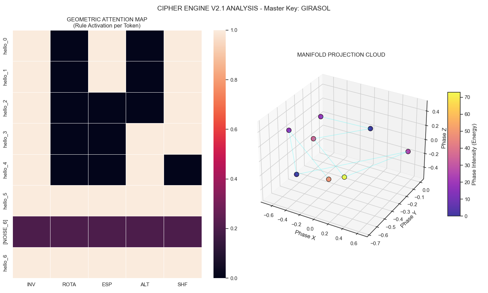
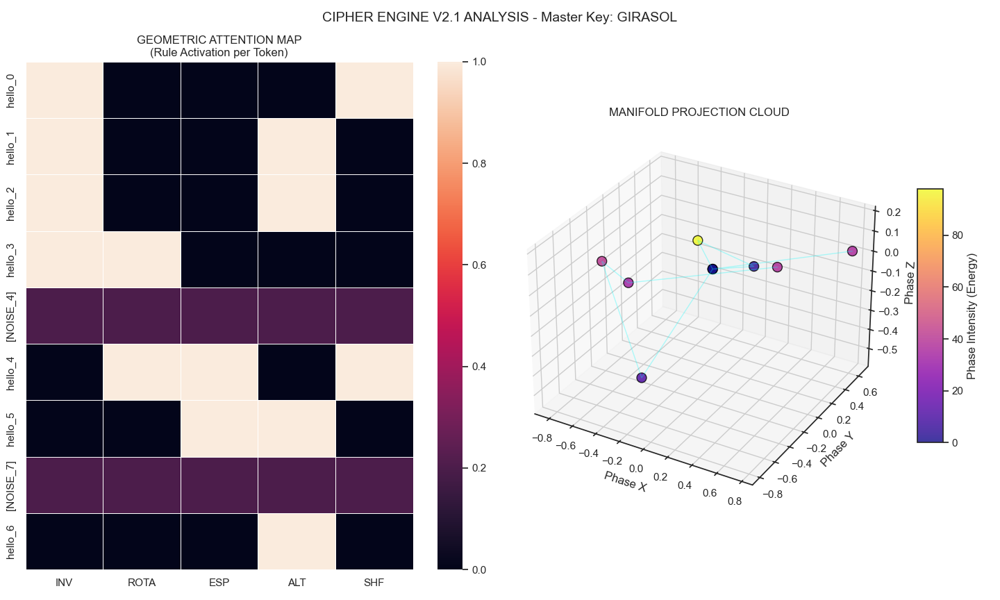
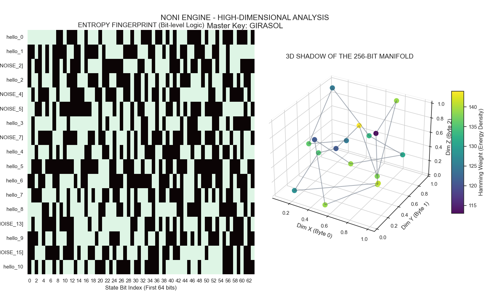

# Noni: A Symbolic Infrastructure for Data Encryption

Noni is a symmetric stream cipher for natural language text, based on a Lattice-based PRNG and a phonetics-driven dispersion engine.

This project has an unusual origin. As a child, I developed a private symbolic language as a personal creative exercise. Years later, that language became the foundation for research into adversarial techniques in large language models. Noni is the next step in that same line: a practical experiment that formalizes those symbolic patterns into a functional cryptographic infrastructure capable of protecting data through high-entropy, multi-dimensional mappings.

This is a practical exercise and experiment in cryptographic design. It is not intended as a production-ready system, and it does not replace audited implementations like AES-GCM or ChaCha20-Poly1305. It is published as an open research artifact.

---

## Technical Architecture

The system consists of six layers that operate in sequence.

### 1. Key Derivation (KDF)

The password is processed through PBKDF2-HMAC-SHA256 with 100,000 iterations and a 16-byte salt generated with `secrets.token_bytes`. This produces a 32-byte high-entropy seed used to derive independent subkeys for integrity (Auth Key) and lattice initialization (Master Value).

### 2. Lattice-based PRNG (LWE Engine)

Noni uses a dynamic lattice-based engine initialized from the stretched seed. Using a public matrix A and an error vector e following Learning With Errors principles, it generates a deterministic private entropy stream. The construction uses modulus q=12289, consistent with Kyber parameters, but is not an implementation of Kyber or any standardized post-quantum primitive. Unlike previous versions that used the decimal digits of Pi as a pseudorandom stream, this stream is private: it depends entirely on the key and salt.

### 3. High-Dimensional Manifold Projection (Evolution)

While previous iterations utilized a discrete 3D state space, Noni v3.0 evolves this concept into a **High-Dimensional Manifold**. Instead of projecting entropy into only three axes, the engine now generates a **256-bit State Vector** per token. 

This transition from 3D to a 256-dimensional space eliminates "state clustering," ensuring that the symbolic dispersion is mathematically deeper and resistant to multidimensional frequency analysis.
Every token is processed through a mapping function that projects entropy into a high-resolution state space. Instead of using discrete 3D axes or a simple 10-bit rule vector, Noni v3.0 generates a **256-bit State Vector** (`state_256`) for every single token position:

```
seed = "{master_value}-pos-{i}-lat-{lattice_digit}-iv-{iv_seed}"
digest = SHA256(seed) -> state_256
```
This 256-bit vector acts as a continuous and deep source of entropy for all internal transformation decisions. Every logic gate—including dynamic vowel map selection, stochastic marker positioning, and syllabic rotation—is governed by specific, independent bits within this vector. This architectural shift ensures that no two tokens share the same transformation logic, even if they contain the same plaintext and appear within the same message stream.

### 4. Deep Polyalphabetic Substitution: Bit-Level Resolution

The new version engine moves beyond word-level rules to **Character-Level Resolution**. Instead of applying a single transformation to an entire word, the 256-bit state vector determines the logic for every single vowel and consonant independently:

*   **Dynamic Vowel Mapping**: For each vowel, the engine consumes specific bits from the state vector to choose between three mapping schemas (Base, Inverse, or Prime). This means the letter "a" might use a different map than the letter "e" within the same word, effectively flattening the frequency distribution.
*   **Stochastic Marker Selection**: The use of activators (`#` or `$`) is no longer rhythmic or alternating. It is determined stochastically by the PRNG state bits, neutralizing any attempt at marker-based syntactic analysis.
*   **Lattice-Driven Consonant Mutation**: Consonants and digits are shifted using a circular alphabet. The displacement value is a result of the manifold state combined with the lattice error term, ensuring that even under known-plaintext attacks, the mutation logic remains obscure.
*   **Syllabic Structural Obfuscation**: Using Pyphen for syllabification, the engine reorders syllables based on the calculated angle $\theta$. In v3.0, this rotation is also bit-governed, adding a layer of structural chaos to the resulting symbolic string.

**Vowel Mapping Schemas (Switched Dynamically):**

| Vowel | Base | Inverse | Alternative (Prime) |
| :--- | :---: | :---: | :---: |
| **a** | 1 | 5 | 4 |
| **e** | 2 | 4 | 3 |
| **i** | 3 | 3 | 1 |
| **o** | 4 | 2 | 5 |
| **u** | 5 | 1 | 2 |

It works with any language. When encrypting English text, Spanish syllable boundaries are applied as an additional layer of structural obfuscation. This behavior is intentional.

### 5. High-Entropy Symbolic Noise Injection (Syntactic Mimicry)

Noise positions within the message stream are determined by the deterministic function `MD5(master_value + "-noise-" + index) % 5 == 0`. These tokens are designed to mimic the syntax and visual entropy of real encrypted content perfectly:

*   **Stochastic Marker Selection**: In v3.0, noise generation uses the same bit-level selection logic for activators (`#` or `$`) as the primary encryption engine. This ensures that the ratio and positioning of these symbols are indistinguishable from data-carrying tokens.
*   **Numerical Distribution**: Noise tokens are populated with digits in the 1-5 range, mirroring the output of the vowel substitution maps.
*   **Structural Uniformity**: Like data tokens, noise tokens are serialized with a length header and subjected to the same 16-byte block padding.

To a statistical analyst or heuristic engine, noise tokens and data tokens are identical. This "Syntactic Mimicry" forces an adversary to attempt decryption on the entire stream, exponentially increasing the computational cost of brute-force or frequency analysis attacks.

### 6. Symbolic Initialization Vector (IV)

A random IV (1-31) is encoded using constants from the original symbolic language: `*=1`, `!=2`, `+=4`, `_=8`, `~=16`. The IV is mixed into the SHA256 seed for every word position, ensuring that the same plaintext encrypted twice produces entirely different output.

---

## Encrypted Package Structure

The final message is a continuous stream with no word delimiters:

```
[HMAC-SHA256 (64 chars)][IV symbols][Salt hex (32 chars)][Encrypted body]
```

Each token, whether data or noise, is serialized as `[length (2 hex chars)][token content]` and padded to a multiple of 16 bytes (BLOCK_SIZE), eliminating structural leakage regarding word length and word count.

---

## Empirical Validation

### Statistical Audit: Million-State Analysis

To validate the engine, Noni underwent a statistical stress test processing 1,000,000 unique encryption states to detect underlying patterns or bias.

Performance metrics: 1,000,000 total iterations, 1.60 seconds execution time, approximately 626,784 operations per second.

Rule activation over 1,000,000 states:

```
INV   50.0460%   deviation 0.0460%   Stable
ROTA  50.0265%   deviation 0.0265%   Stable
ESP   50.0348%   deviation 0.0348%   Stable
ALT   49.9693%   deviation 0.0307%   Stable
SHF   50.0805%   deviation 0.0805%   Stable
```

Global Shannon Entropy: 1.000000 / 1.000000. Manifold coverage: 100% of all 32 possible rule combinations explored.

---

## Integrity and Fidelity Audits

To evaluate the engine's reliability under diverse linguistic conditions, Noni was subjected to high-volume stress tests using two monumental works of literature. These tests target the engine's precision in reconstructing complex punctuation, archaic syntax, and non-standard metadata tokens.

| Dataset | Total Word Tokens | Errors | Success Rate (ISR) | Avg. Processing Speed |
| :--- | :---: | :---: | :---: | :--- |
| **Pride & Prejudice** | 30,313 | 12 | 99.9604% | 0.0130 ms/word |
| **Don Quijote** | 381,217 | 35 | **99.9908%** | 0.0086 ms/word |

### Technical Characterization of Anomalous Reconstruction

The audit identified a marginal cumulative error rate (<0.04%), which consistently manifests as **Positional Symbol Displacement**. This behavior is documented as follows:

*   **Punctuation-Syllable Adjacency Shift**: During the *Syllabic Structural Obfuscation* phase (Layer 4), tokens with leading or trailing punctuation (e.g., `...los` or `(this`) may experience a shift where the symbol is re-attached at the opposite boundary after the state-driven rotation. This results in deterministic outputs such as `los...` or `this(`.
*   **Reconstruction Fidelity vs. Structural Entropy**: Cryptographic integrity remains absolute (no data loss occurs). The discrepancy is strictly a matter of linguistic fidelity, limited to the literal positioning of secondary symbols during the reassembly of rotated syllabic blocks.
*   **Scale Invariance**: The increase in ISR (from 99.96% to 99.99%) when scaling from 30k to 380k words suggests that these anomalies are isolated edge cases and do not scale linearly with volume, confirming the stability of the Lattice-based PRNG and the dispersion engine.

### High-Volume Stress Test: Full Text

Tested on the complete text of Don Quixote under real-world linguistic conditions:

```
Original size:    2,091.3 KB
Encrypted size:   8,685.3 KB
Expansion ratio:  4.15x
Throughput:       612.18 KB/s
```

The 315% increase in file size is a direct result of the phonetic-to-symbolic fragmentation and the symmetric noise strategy. This expansion is the mechanism that enables high entropy and prevents context inference by disrupting standard tokenization patterns.

---

### Visual Analysis of the Dispersion Engine: State Space Evolution

The following plots illustrate the transition from a discrete 3D phase space to a high-dimensional manifold projection. This comparison documents the increase in decision density and the elimination of geometric clustering in the current version.

#### Legacy Analysis (v2.1)
The legacy engine utilized a 3D state space to govern rule activation for consecutive tokens.




In these versions, the **Geometric Attention Map** shows rule activation (INV, ROTA, etc.) as discrete binary blocks. The **Manifold Projection Cloud** displays token dispersion where spatial clustering is visible, indicating a lower-dimensional entropy source for rule selection.

#### High-Dimensional Analysis (v3.0)
The current architecture implements a **256-bit Manifold**, visualized in `Analysis3.png`.



This representation documents the current state of the engine's internal logic:

*   **Entropy Fingerprint (Bit-level Logic)**: This heatmap displays the raw bit states (0-63 of 256) for consecutive token positions. It documents the transition from word-level rules to bit-level micro-decisions.
*   **3D Shadow of the Manifold**: A spatial projection of the 256-dimensional state using Bytes 0, 1, and 2 as coordinate axes. This allows for the observation of the high-dimensional state in a human-readable 3D volume.
*   **Hamming Weight (Energy Density)**: The color scale maps the number of active bits (1s) in the state vector. The observed distribution indicates an even spread of entropy across the state space, with no detectable geometric bias or recurring clusters.

### Technical Analysis: Governance of Restricted Alphabets

A key technical property of Noni v3.0 is the use of a **256-bit State Vector** to govern a restricted symbolic alphabet (5 vowels and 3 mapping schemas). This design choice is based on the following technical observations:

*   **Decision Saturation**: The manifold is used to saturate the logic behind symbol selection. Every token transformation (vowel mapping, consonant displacement, syllabic rotation) is controlled by independent bits within the 256-bit vector, ensuring that the selection process is stochastically independent for every position.
*   **Decoupling of Output and State**: The high dimensionality of the manifold ensures that the state of the engine cannot be inferred from the output symbols. While the output is linguistically constrained, the internal process that reaches that output is governed by a high-resolution entropy stream.
*   **Trajectory Obfuscation**: The use of 256 bits eliminates predictable "paths" in the state space. By applying entropy at a bit-level, the engine ensures that identical plaintext inputs result in different symbolic outputs, effectively neutralizing frequency-based trajectory analysis.

---


## Security Properties

*   **Integrity (Encrypt-then-MAC)**: HMAC-SHA256 detects any bitwise alteration and rejects decryption if the key or ciphertext has been tampered with.

*   **Statistical Flattening**: Syntactic noise injection using `#/$` and digits `1-5` is indistinguishable from real vowel substitution output, neutralizing standard frequency analysis.

*   **Length and Structure Obfuscation**: 16-byte block padding and positional noise injection eliminate word counting and length inference from the ciphertext.

*   **High-Dimensional State Governance**: The 256-bit manifold ensures that the encryption "path" is unique for every token, eliminating geometric clustering even in high-volume streams.

*   **Lattice-based Stream**: The pseudorandom stream depends on a private LWE construction, adding resistance against precomputation and rainbow table attacks.

*   **Kerckhoffs's Principle**: Security depends exclusively on the key and salt; the algorithm remains fully public for peer review.

---

## Limitations

*   **Linguistic Reconstruction Fidelity**: The engine currently exhibits a marginal error rate (~0.01% - 0.04%) in literal reconstruction. This is manifested as positional displacement of non-alphanumeric symbols (e.g., `(this` → `this(`) during syllabic reassembly.

*   **Substitution Alphabet Constraint**: The core substitution layer operates on a small linguistic alphabet. While governed by a 256-bit manifold, it remains a theoretical point of analysis for known-plaintext attacks.

*   **LatticePRNG Complexity**: This is a simplified LWE construction for research purposes. It is not a standardized post-quantum primitive and has not undergone formal cryptanalysis.

*   **Phonetic Dependency**: Reliability is tied to the `Pyphen` library. Technical strings, URLs, or irregular phonetic structures in non-standard languages may produce inconsistent syllabification results.

*   **Implementation Status**: This system has not been audited. It is a research artifact and not a production-ready cryptographic library.

---

---

## Experimental Vision & Philosophy

Noni is an evolving research project that originated from the study of private symbolic languages. Its development follows an organic trajectory: what began as a creative exercise in personal linguistics has expanded into a formalized exploration of high-entropy data dispersion and phonetic obfuscation.

The publication of this project serves as an **open research artifact**. By bridging the gap between symbolic creativity and cryptographic logic, Noni aims to:

1.  **Investigate Phonetic-Based Obfuscation**: Explore how the natural structure of language (syllables, vowels, and rhythm) can be used as a framework for data protection.

2.  **State-Space Innovation**: Stimulate discussion on the use of high-dimensional manifolds to govern simple symbolic outputs, ensuring that even restricted alphabets can achieve high levels of entropy.

3.  **Cross-Disciplinary Dialogue**: Open a space for the intersection of computer science, linguistics, and creative coding, exploring new ways to conceptualize privacy and data representation.

This project is a **proof-of-concept for phonetic-structural encryption**. It is not intended to replace established cryptographic standards like AES, but rather to contribute to the scientific and creative inquiry into how information can be transformed while maintaining a linguistic-like profile.

---
## Installation

```bash
pip install pyphen numpy
```

```python
from noni import NoniEngine

engine = NoniEngine("my_password")
encrypted = engine.encriptar("hello world")
recovered = engine.desencriptar(encrypted)
```

---

## Related Research

This project is part of a broader line of research into adversarial linguistics and LLM security:

- [Architectural Collapse via Blank Spaces Language (BSL)](https://github.com/SerenaGW/RedTeamLowEnthropy)
- [The Paradox of Optimized Fragility](https://github.com/SerenaGW/LLMLanguageFineTuningModifiesMathLogic)
- [Symbolic Language and LLM Resilience](https://github.com/SerenaGW/LLMReadteamSymbolic)
- [Semantic Re-signification and Linguistic DoS](https://github.com/SerenaGW/LLMReadTeamLinguisticDoS)

---

## License

MIT License.

## Author

SerenaGW 
